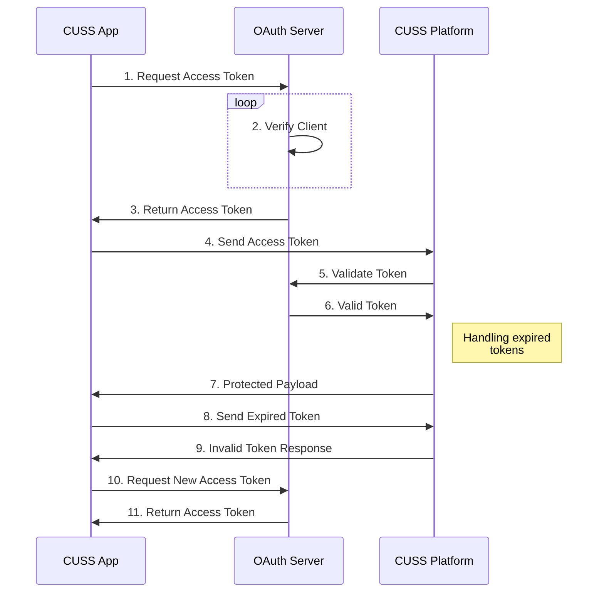

# CUSS 2.0.2 Flow

This document explains the different steps required to communicate with a CUSS 2.0.2 complaint platform, including but not limited to all the available devices 

## Authentication Diagram




<details>
  <summary>Request Sequence Description</summary>

  ## 1. Sending Auth Token

  - **Request:**
    ```json
    {
      "meta": {
        "requestID": "4bb92032-d85e-43c4-9b16-baf6026221c1",
        "oauthToken": "JWT_TOKEN",
        "directive": "platform_environment"
      },
      "payload": {}
    }
    ```
    - **Purpose:** Initiates a request to obtain platform environment data.

  ## 2. Getting ACK by the Platform

  - **Response:**
    ```json
    {
      "ackCode": "ACK_OK",
      "requestID": "4bb92032-d85e-43c4-9b16-baf6026221c1"
    }
    ```
    - **Purpose:** Acknowledgment of successful token authentication.

  ## 3. Receiving environment data

  - **Response:**
    ```json
    {
    "meta": {
        "applicationID": {
            "applicationName": "TestApp", 
            "companyCode": "ELV"
        }, 
        "componentState": "READY", 
        "currentApplicationState": {
            "applicationStateCode": "INITIALIZE"
        }, 
        "eventClassification": {
            "eventCategory": "NORMAL", 
            "eventMode": "SOLICITED", 
            "eventType": "PRIVATE"}, 
            "passengerSessionID": "5b60ca61-b157-4088-8135-d4e9b2150e5f", 
            "platformDirective": "platform_environment", 
            "requestID": "4bb92032-d85e-43c4-9b16-baf6026221c1", 
            "statusCode": "OK", 
            "timeStamp": "Wed, 15 Nov 2023 20:21:51 GMT"
        }, 
    "payload": {
        "environmentLevel": {
            "cussInterfaceVersions": ["2.0"], 
            "cussVersions": ["2.0"], 
            "deviceID": "c3b0fce5b2a3423e3d14e602b065a4957ebe548ce49c2af99c1efe1f", 
            "deviceLocation": {
                "address": "", 
                "airportCode": "DEN", 
                "area": "", 
                "terminal": "EAST"
            }, 
            "initTimeout": 10000, 
            "killTimeout": 10, 
            "osName": "Windows", 
            "osVersion": "10", 
            "sessionTimeout": 10}
        }
    }
    ```
    - **Purpose:** Provides environment-related information requested in step 1.

  ---
  
  ## 4. Requesting components

  - **Request:**
    ```json
    {
      "meta": {
        "requestID": "bfe7914b-4fb7-4d33-b1ae-740fead093e0",
        "oauthToken": "JWT_TOKEN",
        "directive": "platform_components"
      },
      "payload": {}
    }
    ```
    - **Purpose:** Initiates a request to obtain available components.

  ## 5. AKC from the Platform

  - **Response:**
    ```json
    {
      "ackCode": "ACK_OK",
      "requestID": "bfe7914b-4fb7-4d33-b1ae-740fead093e0"
    }
    ```
    - **Purpose:** Acknowledgment of successful component request.

  ## 6. Receiving the components response

  - **Response:**
    ```json
    {
        "meta":{
           "applicationID":{
              "applicationName":"TestApp",
              "companyCode":"ELV"
           },
           "componentState":"READY",
           "currentApplicationState":{
              "applicationStateCode":"INITIALIZE"
           },
           "eventClassification":{
              "eventCategory":"NORMAL",
              "eventMode":"SOLICITED",
              "eventType":"PRIVATE"
           },
           "passengerSessionID":"eba5c6e0-34fc-4926-b76b-e97b8ffc41a7",
           "platformDirective":"platform_components",
           "requestID":"bfe7914b-4fb7-4d33-b1ae-740fead093e0",
           "statusCode":"OK",
           "timeStamp":"Wed, 15 Nov 2023 20:21:51 GMT"
        },
        "payload":{
           "componentList":[
              {
                 "componentCharacteristics":[
                    {
                       "deviceTypesList":[
                          "PRINT"
                       ],
                       "documentBin":{
                          "allmostEmptyLevel":10,
                          "allmostFullLevel":190,
                          "binSize":200
                       },
                       "dsTypesList":[
                          "DS_TYPES_ITPS"
                       ],
                       "mediaTypesList":[
                          "BOARDINGPASS"
                       ]
                    }
                 ],
                 "componentDescription":"CUSTOM 180 Printer BPP",
                 "componentID":0,
                 "componentType":"MEDIA_OUTPUT",
                 "linkedComponentIDs":[
                    1,
                    2
                 ]
              },
              {
                 "componentCharacteristics":[
                    {
                       "deviceTypesList":[
                          "MOTORIZED"
                       ],
                       "dsTypesList":[
                          
                       ],
                       "mediaTypesList":[
                          "BOARDINGPASS"
                       ]
                    }
                 ],
                 "componentDescription":"CUSTOM 180 Printer BPP Feeder",
                 "componentID":1,
                 "componentType":"FEEDER",
                 "linkedComponentIDs":[
                    0,
                    2
                 ]
              },
              {
                 "componentCharacteristics":[
                    {
                       "deviceTypesList":[
                          "DISPENSE"
                       ],
                       "mediaTypesList":[
                          "BOARDINGPASS"
                       ]
                    }
                 ],
                 "componentDescription":"CUSTOM 180 Printer BPP Dispenser",
                 "componentID":2,
                 "componentType":"DISPENSER",
                 "linkedComponentIDs":[
                    0,
                    1
                 ]
              },
              {
                 "componentCharacteristics":[
                    {
                       "deviceTypesList":[
                          "PRINT"
                       ],
                       "documentBin":{
                          "allmostEmptyLevel":10,
                          "allmostFullLevel":190,
                          "binSize":200
                       },
                       "dsTypesList":[
                          "DS_TYPES_ITPS"
                       ],
                       "mediaTypesList":[
                          "BAGGAGETAG"
                       ]
                    }
                 ],
                 "componentDescription":"CUSTOM 180 Printer BTP",
                 "componentID":3,
                 "componentType":"MEDIA_OUTPUT",
                 "linkedComponentIDs":[
                    4,
                    5
                 ]
              },
              {
                 "componentCharacteristics":[
                    {
                       "deviceTypesList":[
                          "MOTORIZED"
                       ],
                       "dsTypesList":[
                          
                       ],
                       "mediaTypesList":[
                          "BAGGAGETAG"
                       ]
                    }
                 ],
                 "componentDescription":"CUSTOM 180 Printer BTP Feeder",
                 "componentID":4,
                 "componentType":"FEEDER",
                 "linkedComponentIDs":[
                    3,
                    5
                 ]
              },
              {
                 "componentCharacteristics":[
                    {
                       "deviceTypesList":[
                          "DISPENSE"
                       ],
                       "mediaTypesList":[
                          "BAGGAGETAG"
                       ]
                    }
                 ],
                 "componentDescription":"CUSTOM 180 Printer BTP Dispenser",
                 "componentID":5,
                 "componentType":"DISPENSER",
                 "linkedComponentIDs":[
                    3,
                    4
                 ]
              },
              {
                 "componentCharacteristics":[
                    {
                       "deviceTypesList":[
                          "FLATBEDSCAN"
                       ],
                       "dsTypesList":[
                          "DS_TYPES_CODELINE"
                       ],
                       "mediaTypesList":[
                          "PASSPORT",
                          "IDCARD",
                          "VISA",
                          "DRIVERLICENSE",
                          "RFID",
                          "NFC",
                          "OCR"
                       ]
                    }
                 ],
                 "componentDescription":"Regula Document Reader",
                 "componentID":6,
                 "componentType":"MEDIA_INPUT",
                 "linkedComponentIDs":[
                    7
                 ]
              },
              {
                 "componentCharacteristics":[
                    {
                       "deviceTypesList":[
                          "ILLUMINATION"
                       ],
                       "mediaTypesList":[
                          "DATASTRUCTURE"
                       ]
                    }
                 ],
                 "componentDescription":"Regula Document Reader DocumentReader Illumination",
                 "componentID":7,
                 "componentType":"DATA_OUTPUT",
                 "linkedComponentIDs":[
                    6
                 ]
              },
              {
                 "componentCharacteristics":[
                    {
                       "deviceTypesList":[
                          "FLATBEDSCAN"
                       ],
                       "dsTypesList":[
                          "DS_TYPES_BARCODE",
                          "DS_TYPES_SCAN_PDF417",
                          "DS_TYPES_SCAN_AZTEC",
                          "DS_TYPES_SCAN_DMATRIX",
                          "DS_TYPES_SCAN_QR"
                       ],
                       "mediaTypesList":[
                          "BARCODE"
                       ]
                    }
                 ],
                 "componentDescription":"Regula Barcode Scanner",
                 "componentID":8,
                 "componentType":"MEDIA_INPUT",
                 "linkedComponentIDs":[
                    9
                 ]
              },
              {
                 "componentCharacteristics":[
                    {
                       "deviceTypesList":[
                          "ILLUMINATION"
                       ],
                       "mediaTypesList":[
                          "DATASTRUCTURE"
                       ]
                    }
                 ],
                 "componentDescription":"Regula Barcode Scanner DocumentReader Illumination",
                 "componentID":9,
                 "componentType":"DATA_OUTPUT",
                 "linkedComponentIDs":[
                    8
                 ]
              }
           ]
        }
     }
    ```
    - **Purpose:** Provides a list of available components along with their characteristics.

    ## 7. Request state change to unavailable

    - **Response:**
      ```json
      {
        "meta": {
          "requestID": "dcb8dda5-78b4-40b4-9a09-1078c2c27256",
          "oauthToken": "JWT_TOKEN",
          "directive": "platform_applications_staterequest"
        },
        "payload": {
          "applicationState": {
            "applicationStateCode": "UNAVAILABLE",
            "applicationStateChangeReason": ""
          }
        }
      }
      
      ```
      - **Purpose:** Requests a change in application state to "UNAVAILABLE".

    ## 8. Getting ACK by the Platform

    - **Response:**
    ```json
    {
        "ackCode": "ACK_OK",
        "requestID": "dcb8dda5-78b4-40b4-9a09-1078c2c27256"
        }
        
    
    ```
    - **Purpose:** Acknowledgment of successful state change request.

    ## 9. Platform response to state change

    - **Response:**
    ```json
    {
        "meta":{
           "applicationID":{
              "applicationName":"TestApp",
              "companyCode":"ELV"
           },
           "componentState":"READY",
           "currentApplicationState":{
              "applicationStateCode":"UNAVAILABLE"
           },
           "eventClassification":{
              "eventCategory":"NORMAL",
              "eventMode":"SOLICITED",
              "eventType":"PRIVATE"
           },
           "passengerSessionID":"e4c74c86-f706-454e-bee0-174f69aff2e1",
           "platformDirective":"platform_applications_staterequest",
           "requestID":"dcb8dda5-78b4-40b4-9a09-1078c2c27256",
           "statusCode":"OK",
           "timeStamp":"Wed, 15 Nov 2023 20:21:51 GMT"
        },
        "payload":{
           
        }
     }
    
    ```
    - **Purpose:** Confirms the platform's response to the state change request.

    ## 10. Querying all components / Example of querying just one with ID 2

    - **Response:**
    ```json
    {
        "meta": {
          "requestID": "1bd863c1-51ff-484a-9e5c-4f3e056a7d6f",
          "oauthToken": "JWT_TOKEN",
          "directive": "peripherals_query",
          "componentID": 2
        },
        "payload": {}
      }
    
    ```
    - **Purpose:** Initiates a query for specific components.

    ## 11. Getting ACK by the Platform

    - **Response:**
    ```json
    {
        "ackCode": "ACK_OK",
        "requestID": "1bd863c1-51ff-484a-9e5c-4f3e056a7d6f"
    }
    
    ```
    - **Purpose:** Acknowledgment of successful component query.
    
    ## 12. Query response

    - **Response:**
    ```json
    {
        "meta":{
           "applicationID":{
              "applicationName":"TestApp",
              "companyCode":"ELV"
           },
           "componentID":2,
           "componentState":"READY",
           "currentApplicationState":{
              "applicationStateCode":"UNAVAILABLE"
           },
           "eventClassification":{
              "eventCategory":"NORMAL",
              "eventMode":"SOLICITED",
              "eventType":"PRIVATE"
           },
           "passengerSessionID":"80dc33b0-f3af-443f-8ecd-16ecaddda311",
           "platformDirective":"peripherals_query",
           "requestID":"1bd863c1-51ff-484a-9e5c-4f3e056a7d6f",
           "statusCode":"OK",
           "timeStamp":"Wed, 15 Nov 2023 20:21:51 GMT"
        },
        "payload":{
           
        }
     }
    
    ```
    - **Purpose:** Provides detailed information about the queried components.

    ## 13. Sending state request to available

    - **Response:**
    ```json
    {
        "meta": {
          "requestID": "c3eb4825-395e-4b54-aebf-3b67c9ddc245",
          "oauthToken": "JWT_TOKEN",
          "directive": "platform_applications_staterequest"
        },
        "payload": {
          "applicationState": {
            "applicationStateCode": "AVAILABLE",
            "applicationStateChangeReason": ""
          }
        }
    }
      
    
    ```
    - **Purpose:** Requests a change in application state to "AVAILABLE".

    ## 14. Getting ACK by the Platform

    - **Response:**
    ```json
    {
        "ackCode": "ACK_OK",
        "requestID": "c3eb4825-395e-4b54-aebf-3b67c9ddc245"
      }
      
    ```
    - **Purpose:** Acknowledgment of successful state change request.

     ## 15. Platform state request response

     - **Response:**
     ```json
     {
        "meta":{
           "applicationID":{
              "applicationName":"TestApp",
              "companyCode":"ELV"
           },
           "componentState":"READY",
           "currentApplicationState":{
              "applicationStateCode":"AVAILABLE"
           },
           "eventClassification":{
              "eventCategory":"NORMAL",
              "eventMode":"SOLICITED",
              "eventType":"PRIVATE"
           },
           "passengerSessionID":"0222397c-1f26-4dcb-adfe-926d36e993fb",
           "platformDirective":"platform_applications_staterequest",
           "requestID":"c3eb4825-395e-4b54-aebf-3b67c9ddc245",
           "statusCode":"OK",
           "timeStamp":"Wed, 15 Nov 2023 20:21:51 GMT"
        },
        "payload":{
           
        }
     }
     
     ```
     - **Purpose:** Confirms the platform's response to the state change request to "AVAILABLE".
    

</details>
