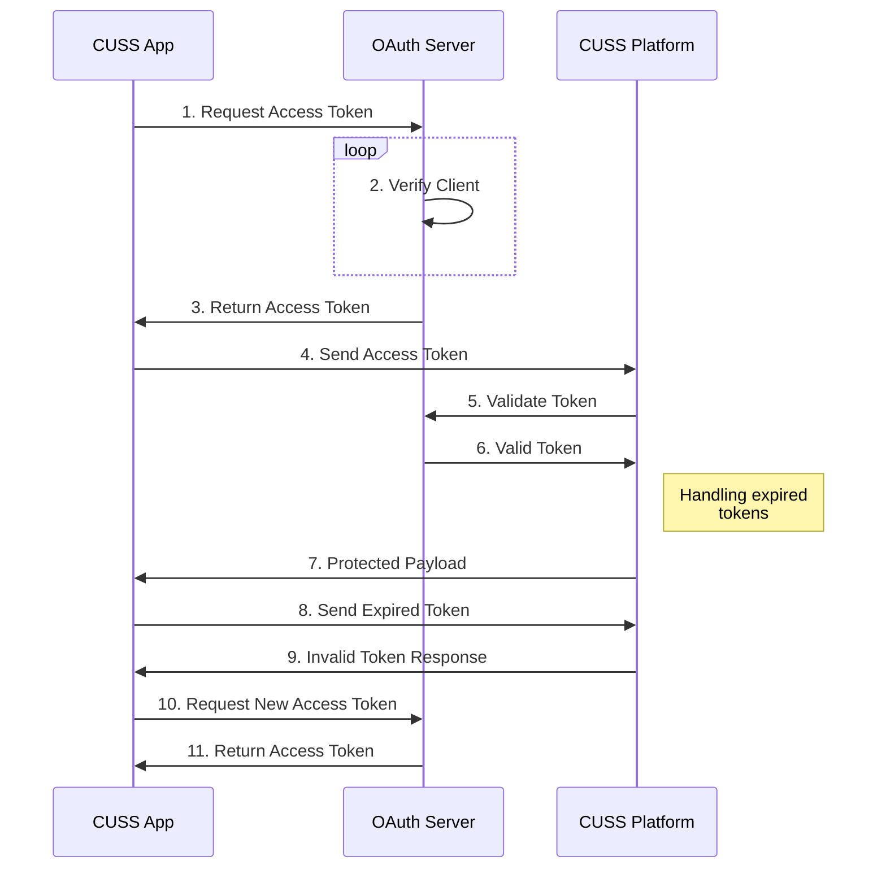

# CUSS 2.0.2 Flow

This document explains the different steps required to communicate with a CUSS 2.0.2 complaint platform, including but not limited to all the available devices 

## Authentication Diagram

